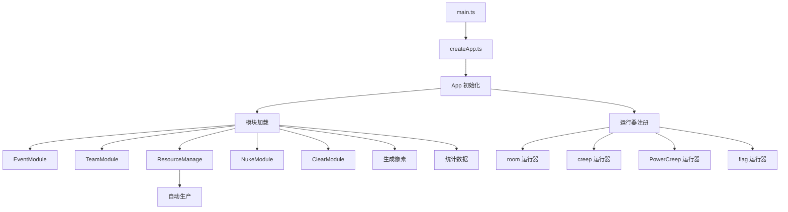

# 核心架构系统（Core Architecture）功能文档

---

## 概述

核心架构系统是 RosmarinBot 的框架层，提供模块化的事件系统、运行器管理和内存缓存机制。整个系统基于事件驱动架构，支持动态模块加载和灵活扩展。

---

## 核心概念

### 1. 应用架构



### 2. 运行周期

每 tick 的执行流程：

```typescript
loop() {
    // 1. 全局 tick 前置
    beforeTick();

    // 2. 模块 tick
    EventModule.tick();

    // 3. 房间执行
    for (const roomName of Game.rooms) {
        Room.run(roomName);
    }

    // 4. Creep 执行
    for (const name of Object.keys(Game.creeps)) {
        Creep.run(Game.creeps[name]);
    }

    // 5. PowerCreep 执行
    for (const name of Object.keys(Game.powerCreeps)) {
        PowerCreep.run(Game.powerCreeps[name]);
    }

    // 6. 旗帜执行
    for (const flagName of Object.keys(Game.flags)) {
        Flag.run(Game.flags[flagName]);
    }

    // 7. 全局 tick 后置
    afterTick();
}
```

### 3. 模块类型

| 模块 | 说明 | 生命周期 |
|------|------|---------|
| `EventModule` | 事件处理系统 | 持续运行 |
| `TeamModule` | 小队系统 | 按需加载 |
| `ResourceManage` | 资源管理 | 持续运行 |
| `NukeModule` | 核弹模块 | 持续运行 |
| `ClearModule` | 数据清理 | 持续运行 |
| `GeneratePixel` | 像素生成 | 按需执行 |
| `Statistics` | 统计数据 | 持续运行 |

---

## 数据结构

### App 接口

```typescript
interface App {
    set: (type: RunnerType, runner: RunnerFn) => void;
    on: (callbacks: RuntimeModule) => void;
    run: () => void;
}

type RunnerType =
    | 'room'
    | 'creep'
    | 'powerCreep'
    | 'flag';

type RunnerFn = (name: string) => void;
```

### 运行时模块接口

```typescript
interface RuntimeModule {
    init?: () => void;
    start?: () => void;
    tick?: () => void;
    end?: () => void;
}
```

### 内存缓存接口

```typescript
interface GlobalMemory {
    RosmarinBot: {
        rooms?: { [roomName: string]: RoomMemory };
        creepCount?: number;
        powerCreepCount?: number;
        [key: string]: any;
    };
}
```

---

## 核心实现

### 1. 应用创建（createApp）

```typescript
const app = {
    runners: { [type: string]: RunnerFn } = {},
    modules: RuntimeModule[] = [],

    // 注册运行器
    set: function(type, runner) {
        this.runners[type] = runner;
    },

    // 注册模块
    on: function(callbacks) {
        this.modules.push(callbacks);
    },

    // 主循环
    run: function() {
        // 执行所有模块的 tick 方法
        for (const module of this.modules) {
            if (module.tick) {
                module.tick();
            }
        }

        // 执行运行器
        for (const [type, runner] of Object.entries(this.runners)) {
            for (const [name, obj] of Object.entries(getGameObjects(type))) {
                runner(name);
            }
        }
    }
};
```

### 2. 模块初始化

```typescript
// 在 main.ts 中初始化应用
const initApp = () => {
    // 注册运行器
    app.set('room', Room.run);
    app.set('creep', Creep.run);
    app.set('powerCreep', PowerCreep.run);
    app.set('flag', Flag.run);

    // 注册模块
    app.on({
        // 事件模块
        init: EventModule.init,
        start: EventModule.start,
        tick: EventModule.tick,
        end: EventModule.end,

        // 资源管理
        tick: ResourceManage.tick,

        // 核弹模块
        tick: NukeModule.tick,

        // 数据清理
        tick: ClearModule.tick,

        // 统计模块
        tick: Statistics.tick,
    });

    // 执行 init 方法
    for (const module of app.modules) {
        if (module.init) {
            module.init();
        }
    }
};
```

### 3. 房间运行器

```typescript
const Room = {
    run: function(roomName: string) {
        const room = Game.rooms[roomName];
        if (!room || !room.my) return;

        // 执行房间主逻辑
        room.execute();

        // 处理 missions
        room.manageMissions();
    },

    execute: function() {
        // 能量采集
        this.runHarvester();

        // 能量搬运
        this.runCarrier();

        // 升级
        this.runUpgrader();

        // 建造
        this.runBuilder();

        // 维修
        this.runRepairer();

        // 防御
        this.runDefender();

        // 外矿
        this.runOutMiner();
    }
};
```

### 4. Creep 运行器

```typescript
const Creep = {
    run: function(creepName: string) {
        const creep = Game.creeps[creepName];
        if (!creep) return;

        const role = creep.memory.role;

        // 根据角色执行对应逻辑
        const roleHandler = CreepRoleHandlers[role];
        if (roleHandler) {
            roleHandler.run(creep);
        }
    }
};
```

### 5. PowerCreep 运行器

```typescript
const PowerCreep = {
    run: function(creepName: string) {
        const creep = Game.powerCreeps[creepName];
        if (!creep) return;

        const className = creep.className;

        // 根据类名执行对应逻辑
        const classHandler = PowerCreepClassHandlers[className];
        if (classHandler) {
            classHandler.run(creep);
        }
    }
};
```

### 6. 旗帜运行器

```typescript
const Flag = {
    run: function(flagName: string) {
        const flag = Game.flags[flagName];
        if (!flag) return;

        // 解析旗帜类型
        const flagType = parseFlagType(flag);

        // 根据类型执行
        const handler = FlagHandlers[flagType];
        if (handler) {
            handler.handle(flag);
        }
    }
};
```

---

## 事件系统

### 1. 事件模块

```typescript
const EventModule = {
    init: function() {
        // 注册全局事件监听器
        Game.on('sign', onSign);
        Game.on('attack', onAttack);
        Game.on('heal', onHeal);
    },

    start: function() {
        console.log('EventModule started');
    },

    tick: function() {
        // 每 tick 执行事件处理
        processEvents();
    },

    end: function() {
        console.log('EventModule ended');
    }
};
```

### 2. 内存缓存系统

```typescript
const MemoryCache = {
    get: function(key: string): any {
        return Memory.RosmarinBot.cache?.[key];
    },

    set: function(key: string, value: any, ttl?: number): void {
        Memory.RosmarinBot.cache = Memory.RosmarinBot.cache || {};
        Memory.RosmarinBot.cache[key] = {
            value,
            timestamp: Game.time,
            ttl: ttl || 1000
        };
    },

    clear: function(key: string): void {
        if (Memory.RosmarinBot.cache?.[key]) {
            delete Memory.RosmarinBot.cache[key];
        }
    },

    cleanup: function(): void {
        // 清理过期的缓存项
        const now = Game.time;
        for (const [key, entry] of Object.entries(Memory.RosmarinBot.cache || {})) {
            if (now - entry.timestamp > (entry.ttl || 1000)) {
                delete Memory.RosmarinBot.cache[key];
            }
        }
    }
};
```

---

## 性能优化

### 1. 分帧执行

```typescript
const FRAMES_PER_TICK = 10;

let currentFrame = 0;

module.loop = () => {
    // 每 tick 只处理一个分帧的任务
    if (currentFrame === 0) {
        // 分帧 0：高优先级任务
        processHighPriority();
    } else if (currentFrame < 3) {
        // 分帧 1-3：房间执行
        processRooms(currentFrame);
    } else if (currentFrame < 6) {
        // 分帧 4-6：Creep 执行
        processCreeps(currentFrame - 3);
    } else if (currentFrame < 9) {
        // 分帧 7-9：模块 tick
        processModules();
    } else {
        // 分帧 10：清理和统计
        processCleanup();
    }

    currentFrame = (currentFrame + 1) % FRAMES_PER_TICK;
};
```

### 2. 内存优化

```typescript
// 使用原型链减少内存占用
const RoomPrototype = {
    execute: function() {
        // 房间逻辑
    },
    manageMissions: function() {
        // 任务管理
    }
};

// 避免闭包中的重复变量
const sharedCache = {
    pathCostMatrix: new Map(),
    creepPositions: new Map()
};
```

### 3. CPU 监控

```typescript
const CPUMonitor = {
    record: function(name: string, cpu: number) {
        const history = CPUMonitor.history[name] || [];
        history.push({ tick: Game.time, cpu });
        if (history.length > 100) history.shift();
        CPUMonitor.history[name] = history;
    },

    getAverage: function(name: string): number {
        const history = CPUMonitor.history[name] || [];
        if (history.length === 0) return 0;
        const sum = history.reduce((s, h) => s + h.cpu, 0);
        return sum / history.length;
    },

    checkLimit: function(name: string, cpu: number): boolean {
        const avg = CPUMonitor.getAverage(name);
        return cpu > avg * 2 && cpu > 10; // 超过平均 2 倍且 > 10 CPU
    }
};
```

---

## 关键文件路径

### 核心框架
- `createApp.ts` - 应用框架
- `main.ts` - 主入口

### 运行器
- `boot/RoomRunner.ts` - 房间运行器
- `boot/CreepRunner.ts` - Creep 运行器
- `boot/PowerCreepRunner.ts` - PowerCreep 运行器
- `boot/FlagRunner.ts` - 旗帜运行器

### 模块
- `modules/runtime/ResourceManage.ts` - 资源管理
- `modules/runtime/NukeModule.ts` - 核弹模块
- `modules/runtime/ClearModule.ts` - 数据清理
- `modules/runtime/Statistics.ts` - 统计模块
- `modules/runtime/GeneratePixel.ts` - 像素生成

---

## 扩展性

### 1. 添加新模块

```typescript
// 1. 创建模块文件
export const NewModule: RuntimeModule = {
    init: () => {
        console.log('NewModule initialized');
    },
    tick: () => {
        // 模块逻辑
    },
    end: () => {
        console.log('NewModule ended');
    }
};

// 2. 在 main.ts 中注册
app.on({
    init: NewModule.init,
    start: NewModule.start,
    tick: NewModule.tick,
    end: NewModule.end
});
```

### 2. 添加新运行器

```typescript
// 1. 创建运行器函数
const newRunner = (name: string) => {
    const object = Game.getObjectById(name);
    if (!object) return;

    // 执行逻辑
    object.run();
};

// 2. 在 createApp.ts 中注册
app.set('newType', newRunner);
```

---

## 优缺点分析

### 优点

1. **模块化**：清晰分离关注点，易于维护
2. **事件驱动**：灵活的事件系统，易于扩展
3. **性能优化**：分帧执行降低 CPU 峰值
4. **内存缓存**：减少重复计算，提高效率
5. **类型安全**：TypeScript 类型定义，减少错误
6. **可扩展**：方便添加新功能模块

### 缺点

1. **学习曲线**：模块化架构需要时间理解
2. **调试困难**：模块间交互复杂，问题定位困难
3. **性能开销**：模块化带来一定的性能开销
4. **过度工程**：简单功能可能过度设计
5. **依赖管理**：模块间依赖关系需要仔细管理

---

## 使用示例

### 1. 添加新模块

```typescript
// 创建新模块
export const AnalyticsModule: RuntimeModule = {
    init: () => {
        Memory.RosmarinBot.analytics = Memory.RosmarinBot.analytics || {};
    },
    tick: () => {
        // 每秒收集一次数据
        if (Game.time % 10 === 0) {
            collectAnalytics();
        }
    },
    end: () => {
        // 保存分析结果
    }
};

// 在 main.ts 中注册
app.on(AnalyticsModule);
```

### 2. 添加自定义运行器

```typescript
// 创建自定义运行器
const customRunner = (name: string) => {
    const obj = Game.getObjectById(name);
    if (!obj) return;

    // 自定义逻辑
    if (obj.structureType === STRUCTURE_LINK) {
        obj.transferEnergy();
    }
};

// 注册运行器
app.set('linkEnergy', customRunner);
```

### 3. 监控模块性能

```typescript
// 在模块中添加 CPU 监控
const ModuleWithMonitoring = {
    tick: function() {
        const startCpu = Game.cpu.getUsed();

        // 模块逻辑
        this.doSomething();

        const usedCpu = Game.cpu.getUsed() - startCpu;

        // 记录 CPU 使用
        CPUMonitor.record(this.name, usedCpu);

        // 检查 CPU 限制
        if (CPUMonitor.checkLimit(this.name, usedCpu)) {
            console.log(`WARNING: ${this.name} using ${usedCpu.toFixed(2)} CPU`);
        }
    }
};
```

---

## 注意事项

1. **模块依赖**：确保模块间的依赖关系正确
2. **内存限制**：注意 Memory 使用，避免超限
3. **CPU 限制**：每个房间 500 CPU，全局 300 CPU
4. **分帧执行**：合理分配任务到不同分帧
5. **错误处理**：模块错误不应影响其他模块
6. **日志记录**：记录关键操作和错误，便于调试
